# ScadaAdminWebJP User Guide

Подробная пользовательская инструкция по работе с веб-администратором ScadaAdminWebJP.

Скриншоты сделаны в теме `default` на живом приложении `http://localhost:11111`. Интерфейс может отличаться, если выбран другой язык, тема или открыт другой проект.

## Содержание

- [Вход](#вход)
- [Главное окно](#главное-окно)
- [Верхняя панель](#верхняя-панель)
- [Дерево проекта](#дерево-проекта)
- [Вкладки редактора](#вкладки-редактора)
- [Таблицы базы конфигурации](#таблицы-базы-конфигурации)
- [Настройки редактора](#настройки-редактора)
- [Communicator](#communicator)
- [Синхронизация каналов с таблицей](#синхронизация-каналов-с-таблицей)
- [Server](#server)
- [Webstation](#webstation)
- [MimicEditorJP](#mimiceditorjp)
- [Tools](#tools)
- [Extensions](#extensions)

## Вход

Откройте адрес веб-администратора в браузере. Если пользователь не вошел в систему, приложение показывает форму входа.

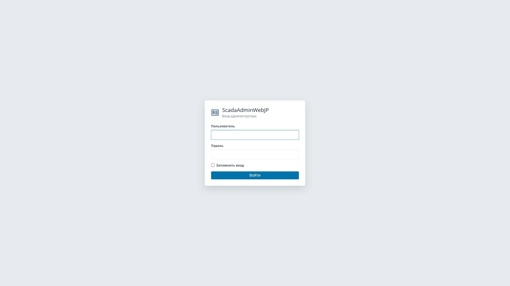

Введите имя пользователя и пароль, затем нажмите `Войти`. После успешного входа откроется главное окно проекта.

## Главное окно

Главное окно состоит из верхней панели команд, дерева проекта слева, рабочей области вкладок и строки состояния снизу.

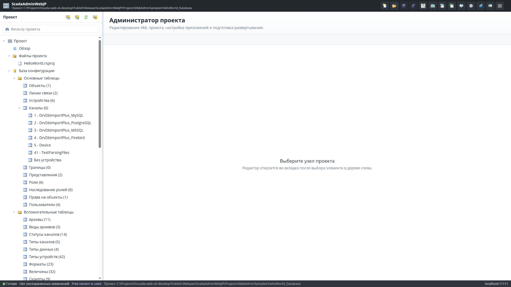

Основные зоны:

| Зона | Назначение |
|---|---|
| Верхняя панель | Команды проекта, сохранения, развертывания, настроек, Tools и Extensions. |
| Дерево проекта | Навигация по файлам проекта, таблицам базы, экземплярам Server, Communicator и Webstation. |
| Рабочая область | Вкладки редакторов таблиц, XML, компонентов, Tools, Extensions и MimicEditorJP. |
| Строка состояния | Текущий раздел, наличие несохраненных изменений, статус лицензии и адрес приложения. |

## Верхняя панель

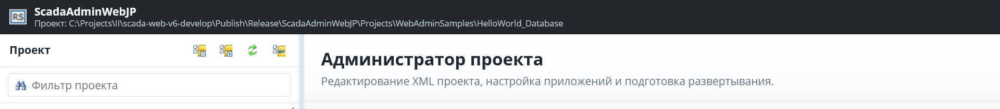

| Кнопка | Где находится | Что делает | Когда использовать | Что меняется после нажатия | Ошибки/ограничения | Скриншот |
|---|---|---|---|---|---|---|
| Создать проект | Верхняя панель, первая кнопка | Открывает форму создания проекта. | Когда нужен новый проект. | Вкладка/форма предлагает параметры нового проекта. | Не закрывайте текущие несохраненные вкладки без сохранения. | `03-topbar-buttons.png` |
| Открыть проект | Верхняя панель | Открывает форму выбора существующего проекта. | Когда нужно переключиться на другой проект. | Дерево и рабочая область перестраиваются под выбранный проект. | Несохраненные изменения нужно сохранить до переключения. | `03-topbar-buttons.png` |
| Сохранить активную вкладку | Верхняя панель | Сохраняет только текущую открытую вкладку. | Когда изменен один редактор. | Dirty-state вкладки снимается, статус показывает результат сохранения. | Кнопка неактивна, если активная вкладка не изменена. | `03-topbar-buttons.png` |
| Сохранить все изменения | Верхняя панель | Сохраняет все измененные вкладки. | Перед закрытием проекта, развертыванием или обновлением дерева. | Dirty-state снимается со всех успешно сохраненных вкладок. | Ошибка одной вкладки может оставить часть изменений несохраненной. | `03-topbar-buttons.png` |
| Создать резервную копию проекта | Верхняя панель | Создает backup активного проекта. | Перед массовыми правками и генерацией каналов. | В статусе появляется результат операции. | Требуются права на запись в папку проекта. | `03-topbar-buttons.png` |
| Профиль развертывания | Верхняя панель | Открывает свойства профиля развертывания. | Перед скачиванием или передачей конфигурации. | Открывается вкладка параметров профиля. | Используется только если проект содержит профиль развертывания. | `03-topbar-buttons.png` |
| Скачать конфигурацию | Верхняя панель | Открывает операцию получения конфигурации из экземпляра. | Когда нужно забрать текущие файлы с узла. | Открывается экран операции развертывания. | Параметры соединения должны быть настроены в профиле. | `03-topbar-buttons.png` |
| Передать конфигурацию | Верхняя панель | Открывает операцию передачи конфигурации на экземпляр. | После подготовки проекта к запуску. | Открывается экран операции развертывания. | Проверяйте профиль и backup перед передачей. | `03-topbar-buttons.png` |
| Статус экземпляра | Верхняя панель | Показывает состояние выбранного экземпляра. | Для проверки доступности узла и служб. | Открывается вкладка статуса. | Требуется доступ к целевому экземпляру. | `03-topbar-buttons.png` |
| Настройка редактора | Верхняя панель | Открывает настройки таблиц, вкладок, языка, темы, проектов и компонентов. | Для настройки поведения редактора. | Открывается вкладка `Настройки редактора`. | Некоторые настройки применяются после сохранения и обновления интерфейса. | `04-editor-settings.png` |
| Инструменты | Верхняя панель | Открывает меню Tools. | Для запуска служебных инструментов администратора. | Появляется меню доступных инструментов. | Набор зависит от установленных Tools. | `12-tools-admin-security.png` |
| Extensions | Верхняя панель | Открывает меню расширений администратора. | Для перехода к установленным расширениям. | Появляется меню доступных Extensions. | Набор зависит от установленных расширений. | `14-extension-external-tools.png` |
| Выйти | Верхняя панель | Завершает пользовательскую сессию. | Когда работа закончена. | Открывается форма входа. | Несохраненные изменения нужно сохранить заранее. | `01-login.png` |

## Дерево проекта

Дерево проекта открывает все основные сущности проекта:

- `Файлы проекта` - файлы внутри проекта, включая XML, представления, мнемосхемы и таблицы.
- `База конфигурации` - основные и вспомогательные таблицы Rapid SCADA.
- `Экземпляры` - настройки `Server`, `Communicator` и `Webstation` для конкретного экземпляра.
- `Расширения` - установленные администраторские extensions.

Кнопки над деревом:

| Кнопка | Что делает |
|---|---|
| Свернуть все | Сворачивает дерево проекта. |
| Развернуть все | Разворачивает дерево проекта. |
| Обновить | Перечитывает структуру проекта и обновляет дерево. |
| Скрыть дерево | Убирает левую панель, освобождая место рабочей области. |

## Вкладки редактора

Каждый выбранный узел открывается во вкладке. Вкладка показывает заголовок элемента и кнопку закрытия.

Правила работы:

- измененная вкладка считается dirty и требует сохранения;
- `Сохранить активную вкладку` сохраняет только текущую вкладку;
- `Сохранить все изменения` проходит по всем dirty-вкладкам;
- закрытие вкладки без сохранения может потерять изменения, если приложение выводит подтверждение и пользователь подтверждает закрытие.

## Таблицы базы конфигурации

Таблицы открываются из раздела `База конфигурации`. На скриншоте открыта таблица `Каналы`.

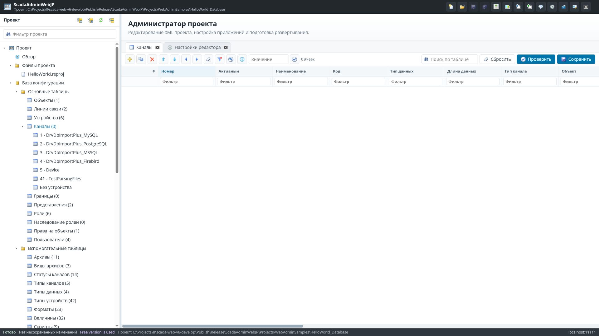

Основные действия в таблицах:

| Кнопка | Что делает |
|---|---|
| Добавить строку | Добавляет новую строку в текущую таблицу. |
| Копировать строку | Создает копию выбранной строки. |
| Удалить строку | Удаляет выбранную строку. |
| Вверх / Вниз | Перемещает выбранную строку. |
| Колонка влево / вправо | Меняет порядок отображения колонок. |
| Сбросить порядок колонок | Возвращает стандартный порядок колонок. |
| Выбрать видимые ячейки колонки | Выделяет ячейки видимой колонки для массового редактирования. |
| Очистить выделение | Снимает выделение ячеек. |
| Открыть свойства отдельно | Открывает инспектор выбранной строки отдельно от таблицы. |

Фильтры под заголовками колонок отбирают строки внутри текущей таблицы. Значения в ячейках редактируются прямо в таблице или через инспектор свойств.

## Настройки редактора

Открываются кнопкой `Настройка редактора`.

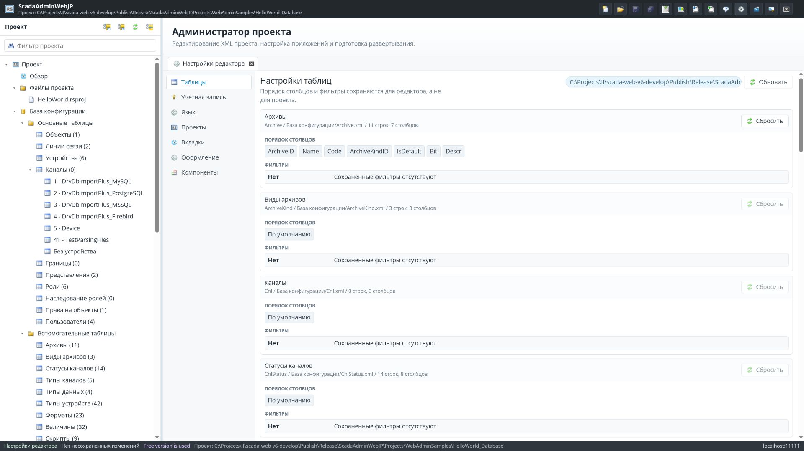

Разделы:

| Раздел | Назначение |
|---|---|
| Таблицы | Поведение табличного редактора. |
| Учетная запись | Параметры пользователя. |
| Язык | Язык интерфейса. |
| Проекты | Параметры открытия проектов. |
| Вкладки | Где открывать вкладки редактора: во фрейме или новой вкладке браузера. |
| Оформление | Тема интерфейса. |
| Компоненты | Список найденных Tools, модулей, плагинов, расширений и runtime-компонентов. |

После изменения темы или режима вкладок нажмите `Сохранить`. Некоторые визуальные изменения применяются сразу, остальные - после обновления страницы.

## Communicator

Раздел `Коммуникатор` находится внутри экземпляра проекта.

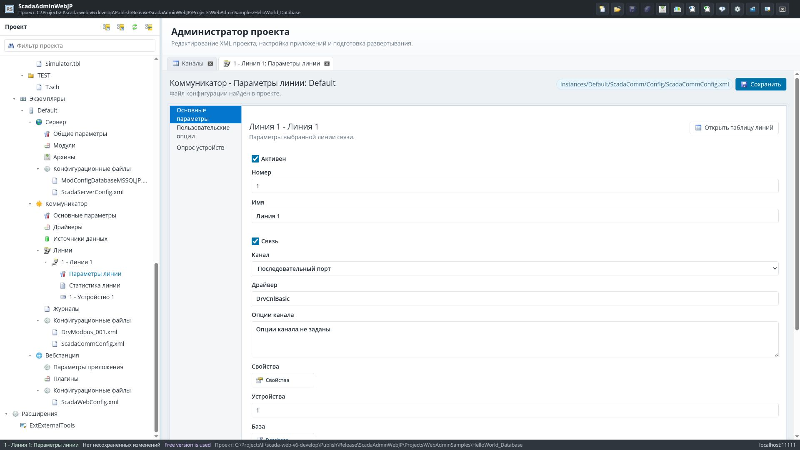

Основные узлы:

| Узел | Что открывает |
|---|---|
| Основные параметры | Общие настройки Communicator. |
| Драйверы | Каталог драйверов устройств, источников данных и каналов связи. |
| Источники данных | Настройку источников данных Communicator. |
| Линии | Таблицу линий связи. |
| Параметры линии | Параметры выбранной линии: канал связи, драйвер канала, свойства канала, устройства. |
| Статистика линии | Настройки статистики выбранной линии. |
| Устройство | Конфигуратор драйвера устройства. Для Modbus это отдельный редактор команд чтения и записи. |
| Журналы | Просмотр журналов Communicator. |

Экран устройства зависит от выбранного драйвера и его web descriptor/AdminActionProvider.

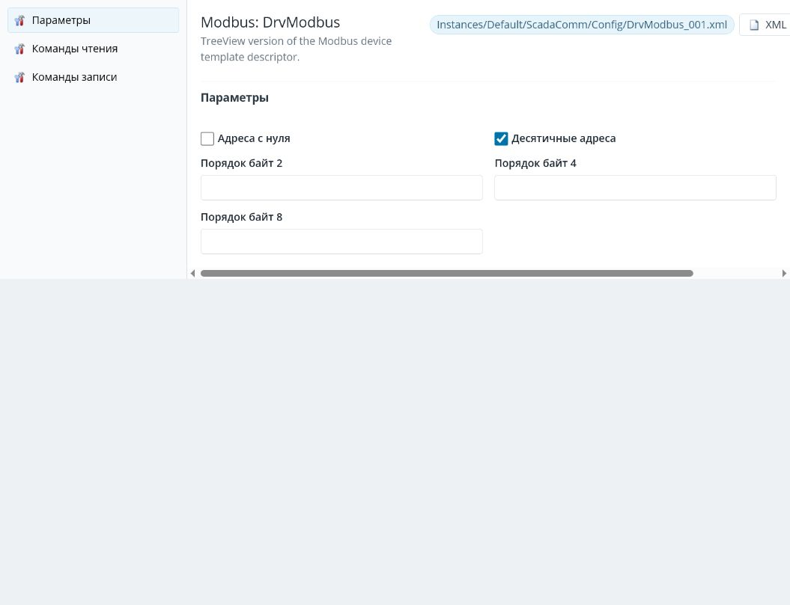

### Типы каналов

В параметрах линии выберите тип канала: последовательный порт, TCP-клиент, TCP-сервер, UDP или другой тип, предоставленный runtime-драйверами. Кнопка `Свойства` открывает форму параметров выбранного типа канала. Эти формы берутся из `AdminWebOptions.json` рядом с runtime-драйвером канала или из встроенного fallback.

## Синхронизация каналов с таблицей

Синхронизация каналов - это создание записей в таблице базы `Cnl` по тегам, которые возвращает драйвер устройства.

Точка входа находится в `Коммуникатор -> Линии`. Выберите линию и устройство, затем используйте команду `Создать каналы`.

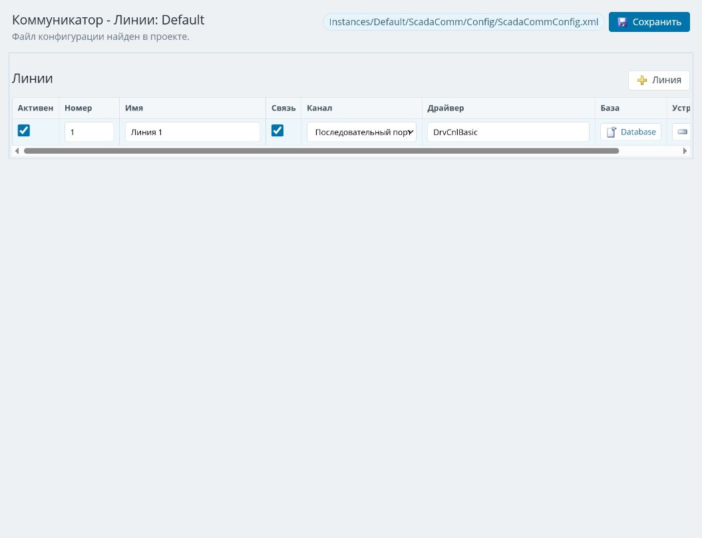

Фактическая логика:

1. Приложение читает текущую конфигурацию Communicator и выбранное устройство.
2. Для драйвера устройства ищется descriptor и действие `GetTags`.
3. Если `GetTags` доступен, сервер вызывает provider драйвера и получает список тегов.
4. Если provider недоступен, сервер пытается использовать fallback по XML-конфигурации драйвера.
5. Предпросмотр показывает найденные прототипы каналов и предлагает `Первый номер канала`.
6. Нажатие финальной кнопки `Создать каналы` записывает новые строки в таблицу `Cnl`.
7. Перед записью создается backup проекта с типом `generate-cnls`.
8. После записи дерево проекта и preview обновляются.

Правильный порядок работы:

1. Настройте линию Communicator и выберите тип канала связи.
2. Откройте свойства канала и заполните параметры подключения.
3. Добавьте или выберите устройство на линии.
4. Откройте конфигуратор драйвера устройства и настройте теги/регистры/команды.
5. Сохраните настройки Communicator и конфигурацию драйвера.
6. Вернитесь в `Коммуникатор -> Линии`.
7. Выберите устройство.
8. Нажмите `Создать каналы` для предпросмотра.
9. Проверьте список тегов и поле `Первый номер канала`.
10. Нажмите финальную кнопку `Создать каналы`, если preview корректен.
11. Откройте `База конфигурации -> Каналы` и проверьте созданные строки.

Что происходит при повторной синхронизации:

- существование канала определяется по паре `DeviceNum + TagCode`;
- если тег уже есть у этого устройства, повторная генерация его пропускает;
- если выбранный `Первый номер канала` уже занят, сервер возвращает ошибку и не создает дубли по номеру;
- если в драйвере появились новые теги, будут добавлены только отсутствующие строки.

Предупреждение: финальное создание каналов меняет файл таблицы `Cnl`. Перед проверками на рабочем проекте создавайте резервную копию.

## Server

Раздел `Сервер` находится внутри экземпляра проекта.

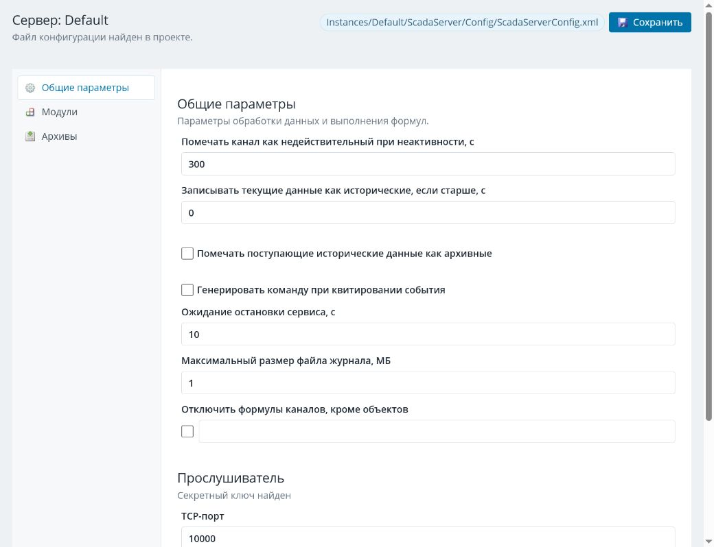

Основные узлы:

| Узел | Назначение |
|---|---|
| Общие параметры | Базовые параметры сервера. |
| Модули | Включение и настройка серверных модулей. |
| Архивы | Настройка архивов сервера. |
| Конфигурационные файлы | Прямое открытие XML-файлов Server. |

## Webstation

Раздел `Вебстанция` находится внутри экземпляра проекта.

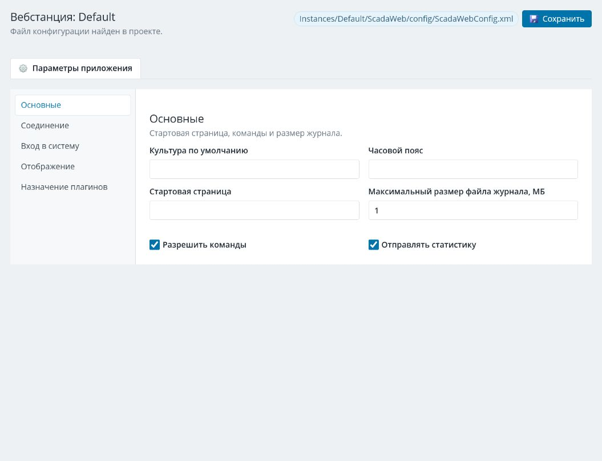

Основные узлы:

| Узел | Назначение |
|---|---|
| Параметры приложения | Общие параметры веб-приложения, вход, отображение и назначение плагинов. |
| Плагины | Список и параметры плагинов Webstation. |
| Конфигурационные файлы | Прямое открытие XML-файлов Webstation. |

## MimicEditorJP

MimicEditorJP открывается при выборе файла `.mim`.

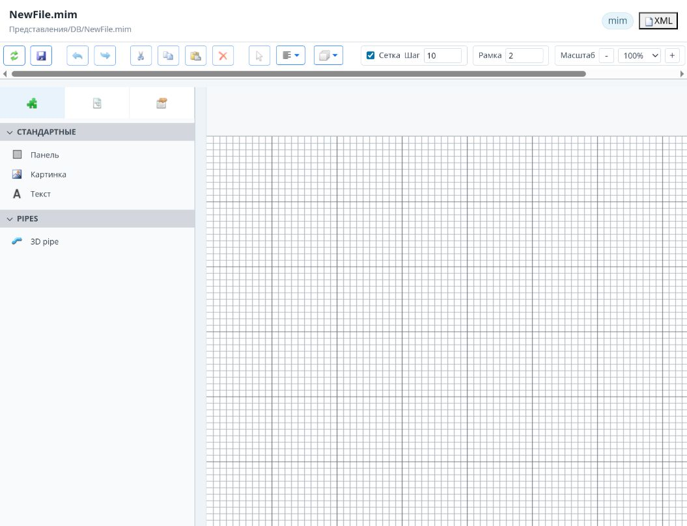

Основные элементы:

| Элемент | Что делает |
|---|---|
| Визуальный режим | Показывает мнемосхему как редактируемую сцену. |
| XML | Переключает редактор в XML-режим. |
| Форматировать | Форматирует XML, если активен XML-режим. |
| Сохранить | Сохраняет мнемосхему. |
| Панель компонентов | Позволяет выбрать компонент, например панель, картинку или текст. |
| Сетка / Шаг | Включает сетку и задает шаг привязки. |
| Рамка | Настраивает толщину рамки выбранных элементов. |
| Масштаб | Меняет масштаб отображения мнемосхемы. |

При сохранении без лицензии сервер добавляет служебный watermark `Используется бесплатная версия` / `Free version is used`. При наличии лицензии служебный watermark удаляется.

## Tools

Tools открываются из верхнего меню `Инструменты`. Это служебные страницы администратора.

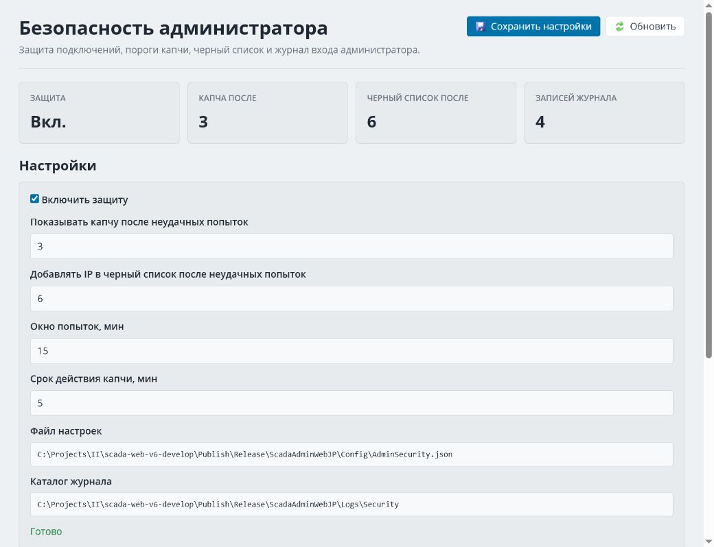

Примеры Tools:

| Tool | Назначение |
|---|---|
| Admin security | Журнал подключений, настройки captcha, черный список IP. |
| О программе / License | Статус лицензии MimicEditorJP, список найденных `.bin` лицензий и генерация activation-файла. |

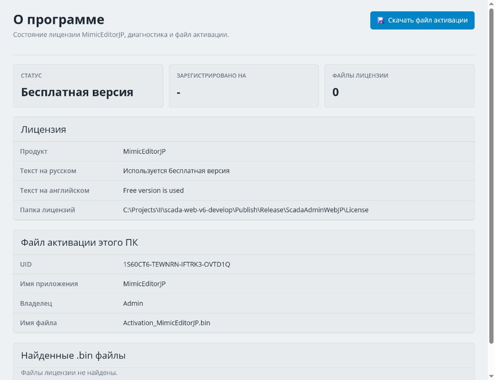

## Extensions

Extensions открываются из верхнего меню расширений или из раздела `Расширения` в дереве проекта.

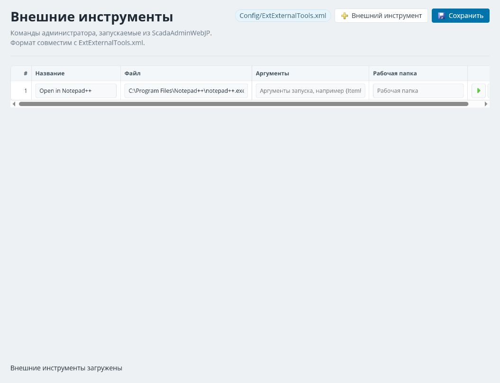

`ExtExternalTools` настраивает внешние команды администратора. Формат совместим с `ExtExternalTools.xml`. После изменения списка команд нажмите `Сохранить`.

## Проверочный чек-лист

Перед передачей инструкции пользователю проверьте:

- все изображения из `Doc/UserGuide/assets` открываются в GitHub preview;
- ссылки оглавления ведут в нужные разделы;
- тема на скриншотах - `default`;
- действия, которые меняют проект, отмечены как изменяющие файлы;
- раздел синхронизации каналов не обещает обновление существующих строк, а описывает фактическое поведение: существующие `DeviceNum + TagCode` пропускаются, новые теги добавляются.
