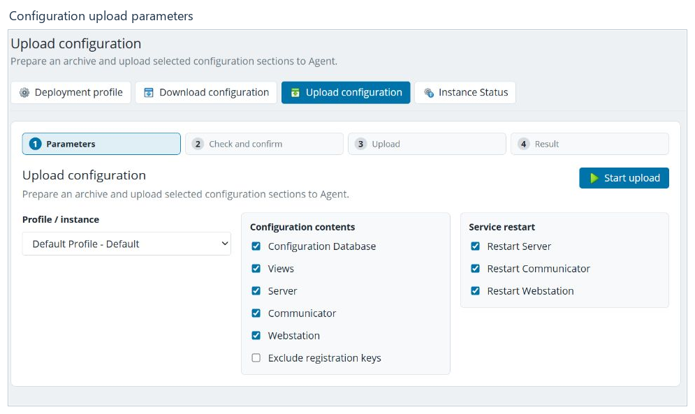

# Configuration deployment

[Contents](README.md) · [Русский](../ru/deployment.md)

Deployment connects a saved project to a Rapid SCADA instance.
**Upload configuration** sends data from the project to the instance.
**Download configuration** retrieves instance data for review and subsequent
application to the project.

## Prepare

1. Check the current project's name and save all changed tabs.
2. Make a backup.
3. Open **Deployment profile and its properties**.
4. Check the selected profile, instance and Agent connection settings.
5. Review the configuration sections to transfer and whether services need restarting.

A profile contains connection settings, not just an instance name. When editing
an existing profile, saved secrets may be represented by a presence indicator
rather than their values. A blank display does not always mean no password
has been set.

This guide covers the general workflow. Configuration of individual deployment
providers and external connection extensions is outside its scope.

## Upload configuration

1. Click **Upload configuration** in the top bar. This opens the wizard;
   opening it does not send the project.
2. At **Parameters**, select **Profile / instance**.
3. Under **Configuration contents**, select the required sections:
   Configuration Database, Views, Server, Communicator and Webstation.
4. Review **Exclude registration keys** and **Service restart** settings.
5. Use **Start upload** to proceed to checking and confirmation.
6. At **Check and confirm**, review the address, profile, sections and warnings
   again. A separate confirmation starts the actual transfer.
7. Wait for **Result** and read the outcome.

Restarting services affects the running instance. Check the profile and options
before each upload, even when the previous upload succeeded. The illustration
shows only the parameter screen.

## Download configuration

1. Open **Download configuration**.
2. Select a profile and the required sections.
3. Complete the check and confirm the download.
4. Review **Preview and apply** after the files are received.
5. Apply changes to the project with the separate confirmation command,
   or finish without applying them.

Downloading and applying are different actions. Successfully receiving files
does not mean they have replaced the current project's files.

## Status and errors

**Instance status** opens the selected instance's status view. Wait for an
operation to finish before starting another one. After a page refresh, the
wizard may restore an existing operation: check its state first to avoid
repeating a transfer.

If an operation fails, retain its error message and check the profile,
destination availability and selected sections. Deployment does not
automatically correct errors in project contents.

**Next:** [Help and troubleshooting](support.md).
