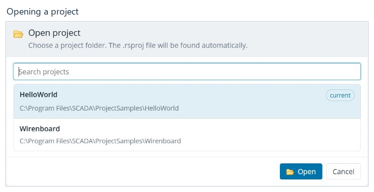
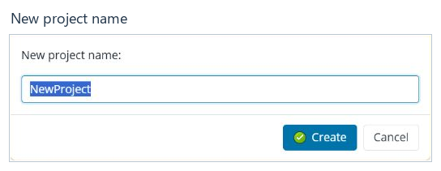

# Working with projects

[Contents](README.md) · [Русский](../ru/projects.md)

## Sign in

Open the browser address configured for your ScadaAdminWebJP installation.
Use the Web Administrator address: the operator's Webstation may use a different
address. Enter username `admin` and password `scada`, then click **Sign in**.

If the page is unavailable, first check the address and whether the application
is running on the server. If the login form reports an error, check your keyboard
layout and credentials. Do not close a working session with unsaved changes.

## Open an existing project

1. Click **Open project**, the folder button in the top bar.
2. Find the project in the list. Use **Search projects** if necessary.
3. Select its folder and click **Open**. The `.rsproj` file inside the folder
   is detected automatically.
4. Confirm that the top bar shows the correct path and the tree contains
   the selected project's data.

The list contains projects available to the application on its server. It does
not select a folder on the computer running your browser. If a project is
missing, check **Editor settings → Projects** and the application's access to
the folder.

Save changes in open tabs before switching projects. **Cancel** closes the
dialog and leaves the current project open.

## Create a project from a template

1. Click **Create project**.
2. Select a template. For example, `EmptyProject.en-GB` contains English project
   dictionaries, while `EmptyProject.ru-RU` contains Russian dictionaries.
3. Click **Continue**.
4. Enter the new project folder name and click **Create**.
5. Check the opened project's name and its contents in the tree.

The template is copied into the projects directory under the new name. Do not
use the name of an existing working project. A template description belongs to
the template and may be written in another language; the editor's interface
language is selected [separately](settings.md#interface-language).

## Make a backup

Before bulk edits or deployment:

1. Click **Save all changes**.
2. Click **Create project backup** in the top bar.
3. Wait for the result message. If the operation fails, check the application's
   access to the destination directory; do not assume a backup exists until
   creation has completed successfully.

A ZIP backup is stored on the application server under
`ProjectBackups/<project name>` in the Web Administrator directory; the result
message identifies the archive. A backup contains saved project files.
Unsaved text in a tab or an edited cell has not yet become part of a saved file.

## Finish a session

Save the required changes, check the status bar and use **Log out**. On your
next sign-in, check which project is open. Closing the browser does not replace
saving the project.

**Next:** [The workspace and saving](workspace.md).
