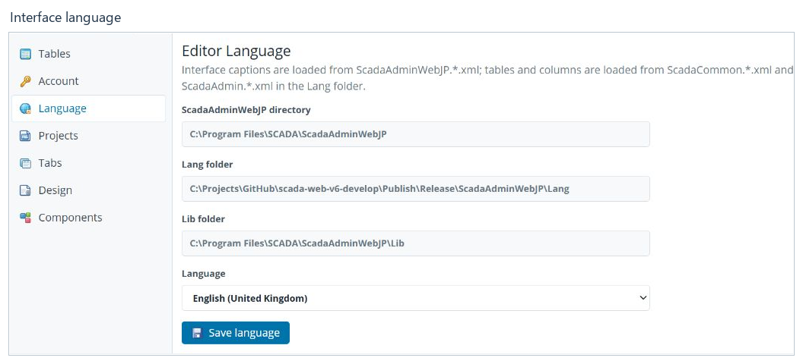
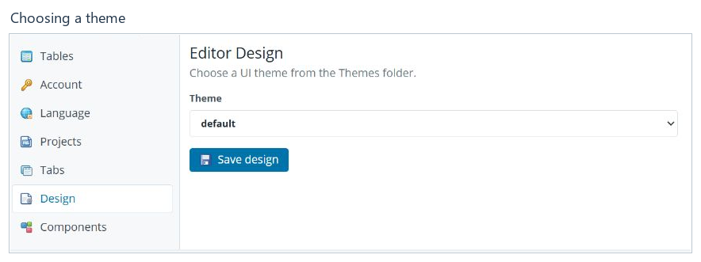
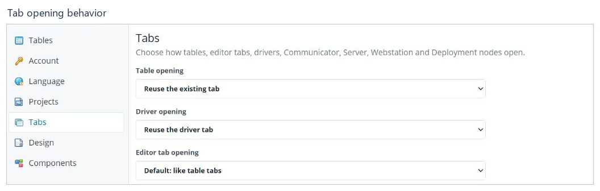

# Editor settings

[Contents](README.md) · [Русский](../ru/settings.md)

Click **Editor settings** in the top bar and select a section on the left.
Each section has its own save command; choosing a new value does not by itself
mean it has been saved.

## Interface language

1. Open **Language**.
2. In the **Language** list, select `English (United Kingdom)`.
3. Click **Save language** and wait for completion.
4. Save any open documents, then refresh the main browser page.
5. Reopen the required sections. If an editor was open on a separate browser
   page, refresh or reopen that page too.
6. Check **Project Administrator**, tree labels, buttons and table column
   headings. They should all be in English.

Refreshing matters: during verification, the settings page had already switched
language while the previously opened shell and tabs still used the old language.
Checking only the selected language option is not enough.

For Russian, choose `русский (Россия) / Russian (Russia)` and repeat the same
steps. User-entered project and device names, paths, filenames and technical
identifiers are not translated by this setting.

The directory fields show where the application obtains its resources.
You do not need to change paths simply to switch languages.

## Theme

Open **Design**, select a theme and click **Save design**. If some icons still
use the previous appearance, refresh the page after saving.

| Theme | Appearance |
|---|---|
| `default` | The light theme used in this guide's screenshots. |
| `dark` | A dark theme with blue tones. |
| `graphite` | A dark gray theme with contrasting gray icons. |

The list depends on the theme directories supplied with your application
version. A theme changes the editor's appearance, not the project data.

## Tab opening behavior

**Tabs** controls whether an existing tab is reused or a separate one is opened,
and whether an editor appears inside the main window or on a new browser page.
There are separate options for tables and different editor groups. The
illustration shows the upper part of the section.

Choose the required behavior, scroll down and click **Save tab settings**.
Check the result by opening a document again.

## Other sections

| Section | Purpose |
|---|---|
| Tables | Saved table display settings, column order and filters; reset the selected table's settings. |
| Account | Change the credentials used to sign in to Web Administrator. Password changes require the current password and confirmation of the new one. |
| Projects | Directories and general settings for projects available to the application. |
| Components | General information and management of available editor components. Their own settings are documented separately. |

The Web Administrator login account and the project's **Users** table have
different purposes. Editing a project table is not a command to change the
password of the current web session.

**Next:** [Configuration deployment](deployment.md).
