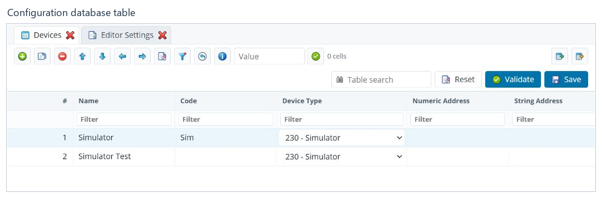
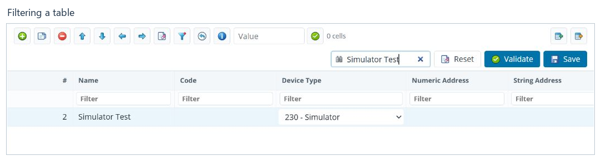

# Configuration database tables

[Contents](README.md) · [Русский](../ru/tables.md)

## Open and edit a table

Select a table under **Configuration Database**. The example shows **Devices**:
commands are above the rows, and column filters are below the headings.

Select a cell and change its value. Depending on the field, the editor uses
text input, a number, a checkbox or a list of references to other records.
Record numbers and reference fields connect tables: check which records use
a value before changing it.

To edit a record in a separate window, select the row and use
**Open row properties separately**.

## Table commands

| Command | Action |
|---|---|
| Add row | Add a record. Complete the required fields and assign a unique number. |
| Copy row | Create a record based on the selected one. Check the copy's number and references. |
| Delete row | Delete the selected record; consider its links to other tables. |
| Move up / Move down | Move the selected row. |
| Move column left / Move column right | Change the display order of columns. |
| Reset column order | Restore the standard order. |
| Select visible cells in column | Select cells for a bulk update, respecting the current filter. |
| Clear cell selection | Remove the selection without changing data. |
| Validate | Check the data and report problems. |
| Save | Write the table changes. |

## Search and filters

Click **Table search** and enter text. The table immediately shows matching
rows. In the screenshot, `Simulator Test` returns one record.

To search a particular field, use the filter below its column heading.
Table search and column filters can apply together. Clear the queries or click
**Reset** to return to the complete set of rows.

Filtering does not delete data. If a row seems to have disappeared, first check
the filters and the selected tree group. Column order and saved filters belong
to [editor settings](settings.md), not to the running system's configuration.

## Update cells in bulk

1. Filter the required rows and select the appropriate column.
2. Click **Select visible cells in column**.
3. Check the selected-cell count beside the value field.
4. Enter the new value in **Value for selected cells**.
5. Click **Apply to selected cells**, inspect the result, then **Validate**
   and **Save**.

This replaces the complete cell value. It does not replace an individual word
inside a text value. For a reference field, use the correct linked-record ID
and check the selected column particularly carefully.

## Import and export

**Export table…** opens the DAT, XML or CSV format selection. Export the entire
table or a specified ID range. Exporting one table is not a backup of the
complete project.

**Import table…** opens file selection. Review the preview first: the numbers
of records to add, replace or skip, and any conflicting IDs. Replacing existing
records requires a separate confirmation. Other table records are retained;
import does not clear the entire table.

Before importing, save or discard unsaved changes to that table in all open
tabs. Afterwards, check the row count, filters and table contents. The same
commands are available in a real table node's context menu; a filtered group
does not have a separate transfer menu.

## Validate and save

Click **Validate**, resolve reported problems with numbers, references or other
data, then save the table. A successful validation message is not a save
confirmation. After saving, check the status bar and the changed-tab indicator.

**Next:** [Editor settings](settings.md).
