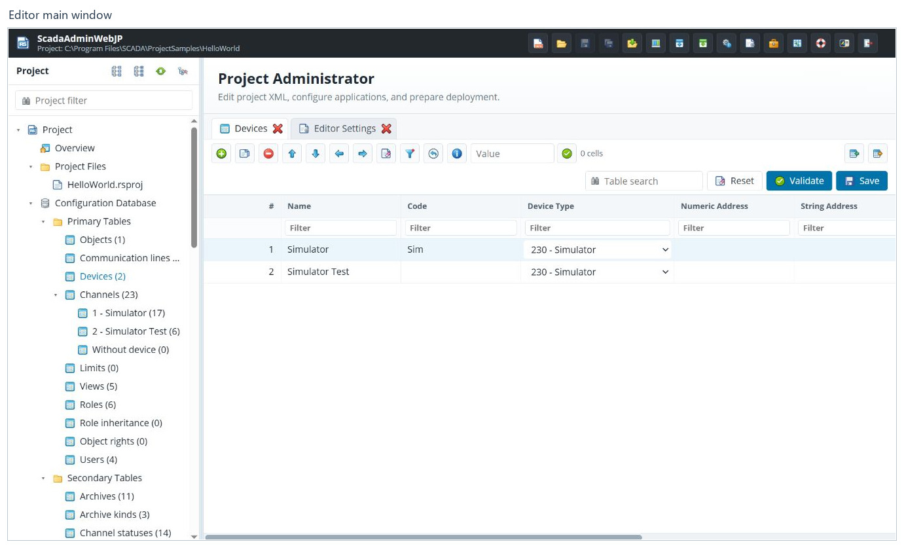
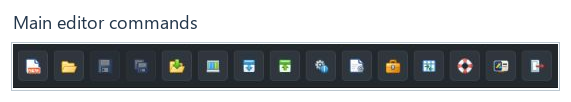

# Workspace

[Contents](README.md) · [Русский](../ru/workspace.md)

## Main window

The top bar contains application commands. The project tree is on the left,
and the tabbed workspace is on the right. The status bar at the bottom reports
operation results and unsaved changes.

## Top bar

Point to an icon to read its command name. A button may be disabled when its
action is not applicable to the current state.

| Command | Purpose |
|---|---|
| Create project | Create a project from a template. |
| Open project | Select another available project. |
| Save active tab | Save changes in the current editor. |
| Save all changes | Save changed tabs. |
| Create project backup | Back up the project's saved files. |
| Deployment profile and its properties | Configure the connection to an instance. |
| Download configuration | Open the configuration download wizard. |
| Upload configuration | Open the configuration upload wizard. |
| Instance status | View the selected instance's status. |
| Editor settings | Open general interface and behavior settings. |
| Tools, Extensions | Open menus of installed additional features. |
| Support | Open links to documentation, releases and forums. |
| About | View application and licensing information, when this command is available. |
| Log out | End the user's session. |

Additional commands depend on the installed components. This guide does not
describe how those components operate.

## Project tree

| Section | Contents |
|---|---|
| Overview | General information about the open project. |
| Project Files | Project files and folders that can be opened. |
| Configuration Database | Rapid SCADA primary and secondary tables. |
| Views | Project view files. Their specialized editors are covered by the corresponding component's documentation. |
| Instances | Project instances and general Server, Communicator and Webstation sections. |
| Extensions | Installed administrator extensions. |

The arrow beside a node expands or collapses its children. Commands above the
tree collapse all nodes, expand all nodes, refresh the tree and hide its panel.
**Project filter** helps locate a node. Hiding an entry with a collapsed tree or
a filter does not delete it from the project.

**Channels** may contain groups by device and a **Without device** group.
These are different ways to display channel-table records; a group is not
a separate set of channels.

## Tabs and files

Click a node to open its editor. Switch documents using the tabs above the
workspace. Whether a document opens inside the main window or on a separate
browser page is controlled by [tab settings](settings.md#tab-opening-behavior).

When opening a file, check its name and path. XML files and other supported
documents open in their corresponding editors. For the meaning of individual
application parameters and driver or plugin file formats, consult their own
documentation.

## General instance settings

Expand **Instances**, select the project instance and open the required section:

- **Server → General Options** — general Server application settings.
- **Communicator → General Options** — general Communicator settings.
- **Webstation → Application Options** — general web application settings.

Check the selected instance before editing. These forms work with the project
configuration; saving is not a command to start or restart a service.
Individual modules, drivers and plugins have their own documentation.

## Save changes

1. After editing, check the unsaved-change indicator in the tab or status bar.
2. Use **Save active tab** for the current document, or **Save** within its editor.
3. Before closing the project, use **Save all changes**.
4. Confirm that saving has succeeded and the required tabs are no longer marked
   as changed.

If one tab fails to save, read that tab's message: successfully saving another
tab does not resolve its error. When closing a changed document, read the
application's prompt and deliberately choose whether to save or discard changes.

Saving writes the project on the Web Administrator server. Applying the
configuration to the running system requires a separate
[deployment](deployment.md).

**Next:** [Configuration database tables](tables.md).
