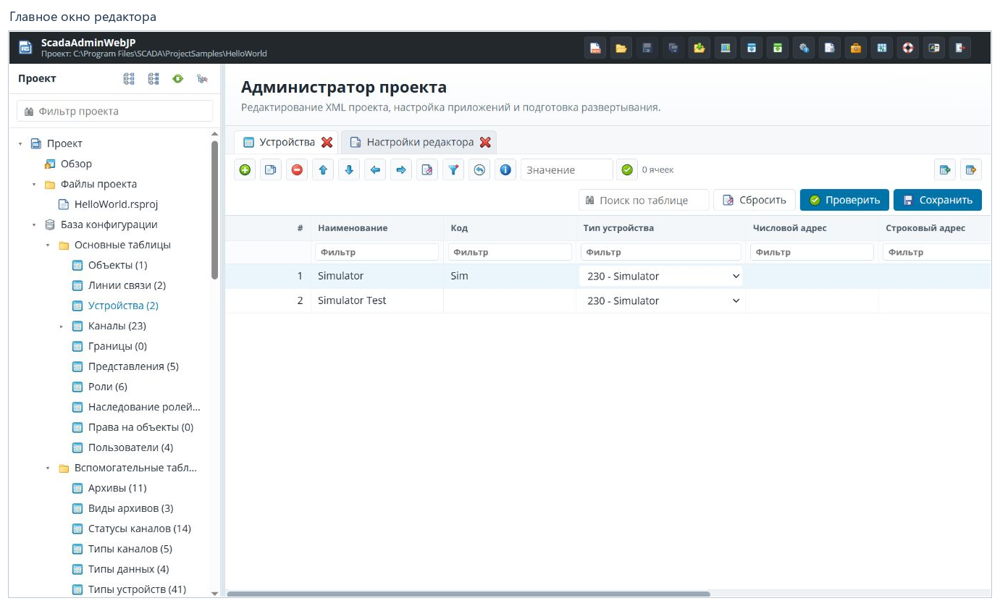

# Руководство пользователя ScadaAdminWebJP

[English](../en/README.md) · [Главная](../README.md)

ScadaAdminWebJP — веб-администратор проектов Rapid SCADA. В нём редактируют
таблицы базы конфигурации и файлы проекта, настраивают приложения экземпляра
и подготавливают конфигурацию к передаче на работающую систему.

Руководство посвящено самому приложению. Настройка протоколов, работа отдельных
драйверов, плагинов и специализированных расширений здесь не рассматриваются.

## Содержание

| Раздел | Что вы узнаете |
|---|---|
| [Проекты](projects.md) | Как войти, открыть или создать проект и сделать резервную копию. |
| [Рабочее пространство](workspace.md) | Верхняя панель, дерево проекта, вкладки и сохранение. |
| [Таблицы базы конфигурации](tables.md) | Строки, фильтры, массовое изменение, проверка, импорт и экспорт. |
| [Настройки редактора](settings.md) | Язык, темы, поведение вкладок и остальные общие настройки. |
| [Развёртывание](deployment.md) | Профиль подключения, передача и скачивание конфигурации. |
| [Справка и решение проблем](support.md) | Где искать помощь и что проверить при затруднениях. |

## Первые шаги

1. Откройте адрес установленного ScadaAdminWebJP и войдите под своей учётной записью.
2. Нажмите **Открыть проект** и выберите нужный проект.
3. Проверьте его имя и путь в верхней панели.
4. В дереве откройте **База конфигурации → Основные таблицы → Устройства**.
5. Изучите таблицу; для поиска используйте поле **Поиск по таблице**.
6. После редактирования нажмите **Проверить**, затем **Сохранить**.
7. Перед передачей на экземпляр сохраните все изменённые вкладки и проверьте
   [профиль развёртывания](deployment.md).

## Как читать иллюстрации

Снимки получены в работающем редакторе с русской локализацией и светлой темой
`default`. Для крупных форм показана нужная часть окна. Подписи над снимками
относятся к документации и не являются частью интерфейса.

`HelloWorld`, `Simulator`, `Default Profile`, пути и имена файлов — примеры данных
проекта. Они могут оставаться на английском: переключение языка интерфейса
не переименовывает пользовательские данные. Ваши проекты, таблицы и состав
команд могут отличаться от показанных.

Снимки проверены 6 сентября 2026 года. Инструкции с английскими названиями
кнопок и отдельными английскими снимками доступны через ссылку **English**
в начале каждого раздела.

**Далее:** [Открытие и создание проектов](projects.md).
