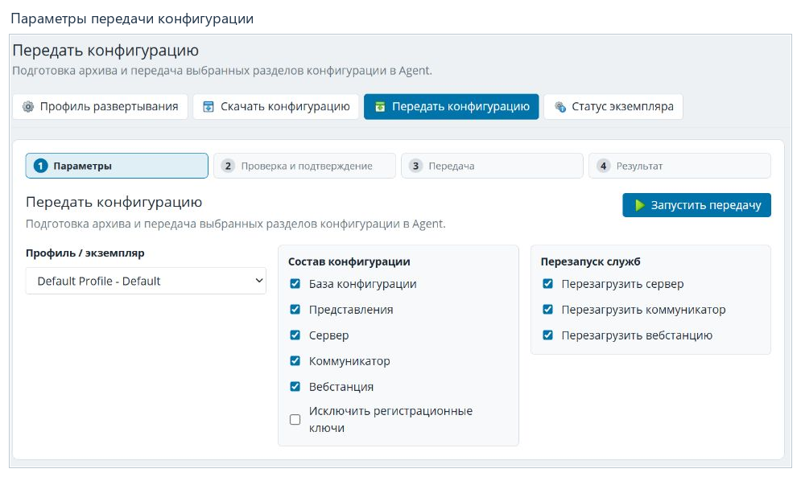

# Развёртывание конфигурации

[Содержание](README.md) · [English](../en/deployment.md)

Развёртывание связывает сохранённый проект с экземпляром Rapid SCADA.
**Передать конфигурацию** означает отправить данные из проекта на экземпляр.
**Скачать конфигурацию** означает получить данные экземпляра для просмотра
и последующего применения к проекту.

## Подготовка

1. Проверьте имя текущего проекта и сохраните все изменённые вкладки.
2. Создайте резервную копию.
3. Откройте **Профиль развёртывания и его свойства**.
4. Проверьте выбранный профиль, экземпляр и параметры соединения с Agent.
5. Сверьте состав передаваемой конфигурации и необходимость перезапуска служб.

Профиль хранит параметры подключения, а не только название экземпляра.
При редактировании существующего профиля сохранённые секреты могут отображаться
признаком наличия, без самого значения. Пустое отображение не всегда означает,
что пароль не задан.

Справка описывает общий порядок работы. Настройка отдельных поставщиков
развёртывания и внешних расширений подключения сюда не входит.

## Передача конфигурации

1. Нажмите **Передать конфигурацию** в верхней панели. Откроется мастер;
   само открытие не отправляет проект.
2. На этапе **Параметры** выберите **Профиль / экземпляр**.
3. В блоке **Состав конфигурации** отметьте нужные разделы: базу конфигурации,
   представления, Сервер, Коммуникатор и Вебстанцию.
4. Проверьте **Исключить регистрационные ключи** и параметры **Перезапуск служб**.
5. Используйте **Запустить передачу**, чтобы перейти к проверке и подтверждению.
6. На этапе **Проверка и подтверждение** ещё раз сверяйте адрес, профиль,
   разделы и предупреждения. Отдельное подтверждение запускает передачу.
7. Дождитесь **Результата** и прочитайте итог операции.

Перезапуск служб влияет на работающий экземпляр. Выбор профиля и флажков
следует проверять перед каждой передачей, даже если предыдущая завершилась
успешно. На иллюстрации показан только экран параметров.

## Скачивание конфигурации

1. Откройте **Скачать конфигурацию**.
2. Выберите профиль и нужные разделы.
3. Пройдите проверку и подтвердите скачивание.
4. Изучите **Предпросмотр и применение** после получения файлов.
5. Примените изменения к проекту отдельной подтверждаемой командой либо
   завершите операцию без применения.

Скачивание и применение — разные действия. Успешное получение файлов ещё
не означает, что они заменили файлы текущего проекта.

## Статус и ошибки

Команда **Статус экземпляра** открывает просмотр состояния выбранного экземпляра.
Во время операции дождитесь её результата, прежде чем начинать следующую.
После обновления страницы мастер может восстановить текущую операцию:
сначала проверьте её состояние, чтобы не повторить передачу.

При ошибке сохраните текст сообщения и проверьте профиль, доступность
целевого адреса и выбранные разделы. Развёртывание не исправляет ошибки
в содержимом проекта автоматически.

**Далее:** [Справка и решение проблем](support.md).
