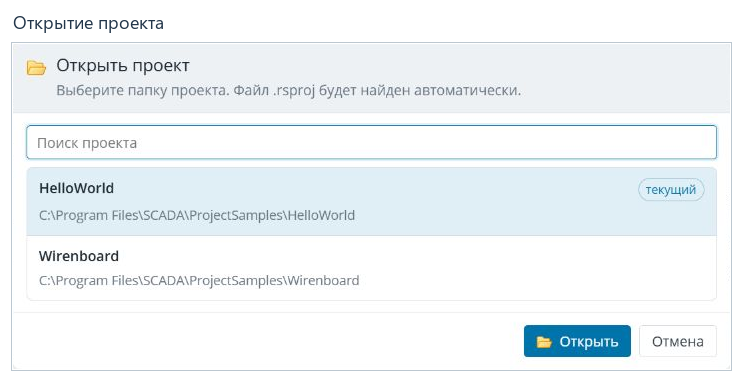
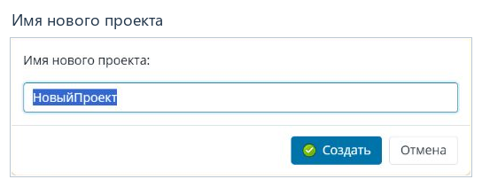

# Работа с проектами

[Содержание](README.md) · [English](../en/projects.md)

## Вход в приложение

Откройте в браузере адрес, заданный при установке ScadaAdminWebJP. Используйте
адрес веб-администратора: адрес операторской Вебстанции может быть другим.
Введите имя пользователя `admin` и пароль `scada`, затем нажмите **Войти**.

Если страница недоступна, сначала проверьте адрес и запуск приложения на сервере.
Если форма входа сообщает об ошибке, проверьте раскладку клавиатуры и учётные
данные. Не закрывайте рабочую сессию с несохранёнными изменениями.

## Открыть существующий проект

1. Нажмите **Открыть проект** в верхней панели — кнопку с папкой.
2. Найдите проект в списке. При необходимости используйте поле **Поиск проекта**.
3. Выберите нужную папку и нажмите **Открыть**. Файл `.rsproj` внутри неё
   определяется автоматически.
4. Убедитесь, что в верхней панели показан правильный путь и дерево содержит
   данные выбранного проекта.

Список показывает проекты, доступные приложению на сервере. Это не выбор папки
на компьютере, с которого открыт браузер. Если проекта нет в списке, проверьте
параметры раздела **Настройка редактора → Проекты** и доступ приложения к папке.

Перед переключением проекта сохраните изменения в открытых вкладках. Кнопка
**Отмена** закрывает диалог, оставляя текущий проект открытым.

## Создать проект из шаблона

1. Нажмите **Создать проект**.
2. Выберите шаблон. Например, `EmptyProject.ru-RU` содержит русские словари
   проекта, а `EmptyProject.en-GB` — английские.
3. Нажмите **Продолжить**.
4. Введите имя новой папки проекта и нажмите **Создать**.
5. Проверьте имя открытого проекта и его содержимое в дереве.

Шаблон копируется в папку проектов под новым именем. Не используйте имя уже
существующего рабочего проекта. Описание шаблона относится к его содержимому
и может быть написано на другом языке; язык самого редактора выбирается
[отдельно](settings.md#язык-интерфейса).

## Резервная копия

Перед массовыми изменениями или развёртыванием:

1. Нажмите **Сохранить все изменения**.
2. Нажмите **Создать резервную копию проекта** в верхней панели.
3. Дождитесь сообщения о результате. При ошибке проверьте доступ приложения
   к папке назначения; не считайте копию созданной до успешного завершения.

ZIP-архив сохраняется на сервере приложения в каталоге
`ProjectBackups/<имя проекта>` внутри папки веб-администратора; сообщение
о результате указывает созданный архив. Резервная копия относится
к сохранённым файлам проекта. Несохранённый текст вкладки или изменённая ячейка
ещё не являются сохранённым файлом.

## Завершить работу

Сохраните нужные изменения, проверьте строку состояния и используйте **Выйти**.
При следующем входе проверьте, какой проект открыт. Закрытие браузера
не заменяет сохранение проекта.

**Далее:** [Рабочее пространство и сохранение](workspace.md).
