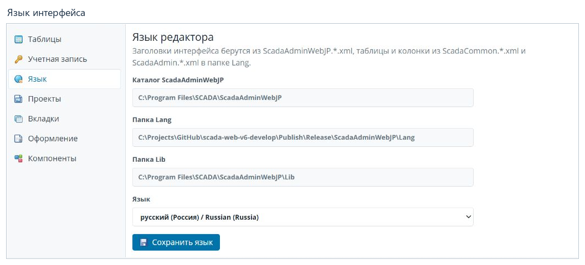
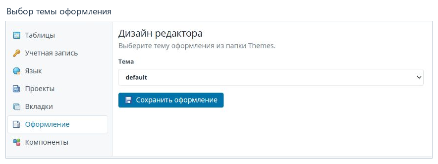
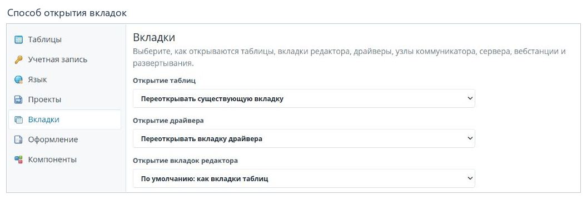

# Настройки редактора

[Содержание](README.md) · [English](../en/settings.md)

Откройте **Настройка редактора** в верхней панели. В левой части страницы
выберите раздел. У каждого раздела есть собственная команда сохранения;
выбор нового значения сам по себе не означает, что оно уже сохранено.

## Язык интерфейса

1. Откройте **Язык**.
2. В списке **Язык** выберите `русский (Россия) / Russian (Russia)`.
3. Нажмите **Сохранить язык** и дождитесь сообщения о завершении.
4. Сохраните открытые документы, затем обновите основную страницу браузера.
5. Повторно откройте нужные разделы. Если редактор был открыт отдельной
   страницей, обновите или переоткройте и её.
6. Проверьте заголовок **Администратор проекта**, подписи дерева, кнопки
   и заголовки столбцов. Они должны быть на русском.

Обновление страницы важно: при проверке настройка уже применялась внутри окна
настроек, а ранее открытая оболочка и вкладки ещё сохраняли прежний язык.
Не ограничивайтесь проверкой выбранного пункта в списке.

Для английской версии выберите `English (United Kingdom)` и повторите те же
действия. Названия проектов и устройств, введённые пользователем, пути,
имена файлов и технические идентификаторы от этого не переводятся.

Поля каталогов показывают, откуда приложение берёт свои ресурсы. Для обычной
смены языка менять пути не нужно.

## Тема оформления

Откройте **Оформление**, выберите тему и нажмите **Сохранить оформление**.
Если часть значков ещё имеет старый вид, обновите страницу после сохранения.

| Тема | Вид |
|---|---|
| `default` | Светлая тема, используемая на снимках этого руководства. |
| `dark` | Тёмная тема с синими оттенками. |
| `graphite` | Тёмно-серая тема с контрастными серыми значками. |

Список зависит от каталогов тем, поставленных с вашей версией приложения.
Тема изменяет оформление редактора, а не данные проекта.

## Открытие вкладок

Раздел **Вкладки** определяет, переиспользовать ли открытую вкладку или создавать
отдельную, а также где открывать редактор — внутри основного окна или на новой
странице браузера. Для таблиц и разных групп редакторов доступны отдельные
параметры. На иллюстрации показана верхняя часть раздела.

Выберите нужное поведение, прокрутите раздел вниз и нажмите
**Сохранить настройки вкладок**. Проверяйте результат на заново открытом документе.

## Другие разделы

| Раздел | Назначение |
|---|---|
| Таблицы | Сохранённые настройки отображения таблиц, порядка столбцов и фильтров; сброс настроек выбранной таблицы. |
| Учётная запись | Изменение учётных данных входа в веб-администратор. Для смены пароля используется текущий пароль и подтверждение нового. |
| Проекты | Каталоги и общие параметры работы с проектами, доступными приложению. |
| Компоненты | Общая информация и управление доступными компонентами редактора. Их собственные параметры описываются отдельно. |

Учётная запись входа в веб-администратор и записи таблицы **Пользователи**
в проекте служат разным задачам. Изменение таблицы проекта не является командой
смены пароля текущей веб-сессии.

**Далее:** [Развёртывание конфигурации](deployment.md).
