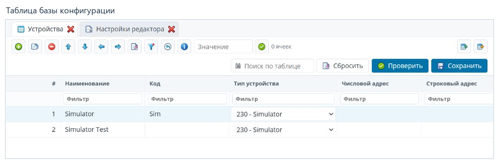
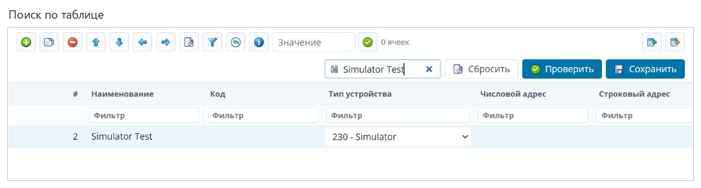

# Таблицы базы конфигурации

[Содержание](README.md) · [English](../en/tables.md)

## Открыть и изменить таблицу

Выберите таблицу в разделе **База конфигурации**. На примере показана таблица
**Устройства**: над строками находятся команды, под заголовками — фильтры столбцов.

Выберите нужную ячейку и измените значение. В зависимости от поля используется
текстовый ввод, число, флажок или список ссылок на другие записи. Номер и
ссылочные поля связывают таблицы между собой: перед изменением проверьте,
какие записи используют это значение.

Для редактирования записи в отдельном окне выберите строку и используйте
**Открыть свойства строки отдельно**.

## Команды таблицы

| Команда | Действие |
|---|---|
| Добавить строку | Добавляет новую запись. Заполните обязательные поля и уникальный номер. |
| Копировать строку | Создаёт запись на основе выбранной. Проверьте номер и ссылки копии. |
| Удалить строку | Удаляет выбранную запись; учитывайте связи с другими таблицами. |
| Вверх / Вниз | Изменяет положение выбранной строки. |
| Столбец левее / Столбец правее | Меняет порядок отображения столбцов. |
| Сбросить порядок столбцов | Возвращает стандартный порядок. |
| Выбрать видимые ячейки столбца | Выделяет ячейки для группового изменения с учётом фильтра. |
| Очистить выбор ячеек | Снимает выделение, не меняя данные. |
| Проверить | Проверяет данные и показывает найденные проблемы. |
| Сохранить | Записывает изменения таблицы. |

## Поиск и фильтры

Нажмите поле **Поиск по таблице** и введите текст. Таблица сразу показывает
совпавшие строки. На снимке введено `Simulator Test`, поэтому видна одна запись.

Для поиска по конкретному полю используйте фильтр под заголовком его столбца.
Общий поиск и фильтры столбцов могут действовать одновременно. Очистите запросы
или нажмите **Сбросить**, чтобы вернуться к полному набору строк.

Фильтрация не удаляет данные. Если строка «пропала», сначала проверьте фильтры
и выбранную группу в дереве. Порядок столбцов и сохранение фильтров относятся
к [настройкам редактора](settings.md), а не к конфигурации работающей системы.

## Массовое изменение

1. Отфильтруйте нужные строки и выберите нужный столбец.
2. Нажмите **Выбрать видимые ячейки столбца**.
3. Проверьте число выбранных ячеек рядом с полем значения.
4. Введите новое значение в поле **Значение для выбранных ячеек**.
5. Нажмите **Применить к выбранным ячейкам**, проверьте результат, затем
   **Проверить** и **Сохранить**.

Меняется значение ячейки целиком. Эта операция не заменяет отдельное слово
внутри текста. Для ссылочного поля задавайте корректный идентификатор связанной
записи и особенно внимательно проверяйте выделенный столбец.

## Импорт и экспорт

**Экспорт таблицы…** открывает выбор формата DAT, XML или CSV. Можно выгрузить
таблицу целиком либо выбранный диапазон идентификаторов. Экспорт отдельной
таблицы не является резервной копией всего проекта.

**Импорт таблицы…** открывает выбор файла. Сначала изучите предпросмотр:
сколько строк добавляется, заменяется или пропускается и какие номера
конфликтуют. Замена существующих записей требует отдельного подтверждения.
Остальные строки таблицы сохраняются — импорт не очищает её целиком.

Перед импортом сохраните или отмените несохранённые изменения этой таблицы
во всех открытых вкладках. После операции проверьте счётчик строк, фильтр
и результат в таблице. Те же команды доступны через контекстное меню узла
настоящей таблицы; у группы-фильтра отдельного меню переноса нет.

## Проверить и сохранить результат

Нажмите **Проверить**, исправьте сообщения о номерах, ссылках или других данных,
затем сохраните таблицу. Сообщение об успешной проверке не заменяет сохранение.
После сохранения проверьте строку состояния и индикатор изменённой вкладки.

**Далее:** [Настройки редактора](settings.md).
