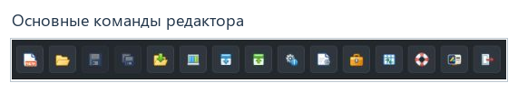

# Рабочее пространство

[Содержание](README.md) · [English](../en/workspace.md)

## Главное окно

Верхняя панель содержит команды приложения. Слева находится дерево проекта,
справа — рабочая область с вкладками. Строка состояния внизу сообщает о результате
операций и наличии несохранённых изменений.

## Верхняя панель

Наведите указатель на значок, чтобы прочитать название команды. Кнопка может
быть неактивна, если действие неприменимо к текущему состоянию.

| Команда | Назначение |
|---|---|
| Создать проект | Создание проекта из шаблона. |
| Открыть проект | Выбор другого доступного проекта. |
| Сохранить активную вкладку | Запись изменений текущего редактора. |
| Сохранить все изменения | Сохранение изменённых вкладок. |
| Создать резервную копию проекта | Резервная копия сохранённых файлов проекта. |
| Профиль развёртывания и его свойства | Настройки подключения к экземпляру. |
| Скачать конфигурацию | Открытие мастера получения конфигурации. |
| Передать конфигурацию | Открытие мастера передачи конфигурации. |
| Статус экземпляра | Просмотр состояния выбранного экземпляра. |
| Настройка редактора | Общие настройки интерфейса и поведения. |
| Инструменты, Расширения | Меню установленных дополнительных средств. |
| Поддержка | Справочная страница со ссылками на документацию, выпуски и форумы. |
| О программе | Информация о приложении и лицензировании, если соответствующая команда доступна. |
| Выйти | Завершение сессии пользователя. |

Состав дополнительных команд зависит от установленных компонентов. Работа
этих компонентов в данном руководстве не описывается.

## Дерево проекта

| Раздел | Содержимое |
|---|---|
| Обзор | Общая информация об открытом проекте. |
| Файлы проекта | Файлы и папки проекта, доступные для открытия. |
| База конфигурации | Основные и вспомогательные таблицы Rapid SCADA. |
| Представления | Файлы представлений проекта. Их специализированные редакторы рассматриваются в справке соответствующего компонента. |
| Instances / экземпляры | Экземпляры проекта и общие разделы Сервера, Коммуникатора и Вебстанции. |
| Расширения | Установленные расширения администратора. |

Стрелка рядом с узлом раскрывает или сворачивает дочерние элементы. Команды над
деревом позволяют свернуть всё, развернуть всё, обновить дерево и скрыть панель.
Поле **Фильтр проекта** помогает найти нужный узел. Скрытая деревом или фильтром
запись не удаляется из проекта.

Узел **Каналы** может содержать группы по устройствам и группу **Без устройства**.
Это разные способы показать записи таблицы каналов; группа не является новым
набором каналов.

## Вкладки и файлы

Нажмите узел, чтобы открыть его редактор. Переключайтесь между документами через
вкладки над рабочей областью. Вид открытия — в общей области или на отдельной
странице браузера — задаётся в [настройках вкладок](settings.md#открытие-вкладок).

При открытии файла проверьте его имя и путь. XML-файлы и другие поддерживаемые
документы редактируются соответствующим редактором. Назначение отдельных
параметров приложений и форматы драйверов или плагинов ищите в их собственной
документации.

## Общие настройки экземпляра

Раскройте **Instances**, выберите экземпляр проекта и откройте нужный раздел:

- **Сервер → Общие параметры** — общие настройки серверного приложения.
- **Коммуникатор → Основные параметры** — общие настройки коммуникатора.
- **Вебстанция → Параметры приложения** — общие настройки веб-приложения.

Проверьте выбранный экземпляр перед редактированием. Эти формы работают
с конфигурацией проекта; сохранение не является командой запуска или
перезапуска службы. Разделы отдельных модулей, драйверов и плагинов имеют
собственную документацию.

## Сохранение

1. После изменения проверьте индикатор несохранённых данных во вкладке или строке состояния.
2. Для текущего документа используйте **Сохранить активную вкладку** либо
   **Сохранить** в его редакторе.
3. Перед закрытием проекта используйте **Сохранить все изменения**.
4. Убедитесь, что операция завершилась успешно и нужные вкладки больше
   не отмечены как изменённые.

Если одна вкладка не сохранилась, прочитайте сообщение именно этой вкладки:
успешное сохранение другой не устраняет её ошибку. При закрытии изменённого
документа прочитайте запрос приложения и сохраняйте либо отбрасывайте правки
осознанно.

Сохранение записывает проект на сервере веб-администратора. Для применения
конфигурации работающей системой используется отдельное
[развёртывание](deployment.md).

**Далее:** [Таблицы базы конфигурации](tables.md).
